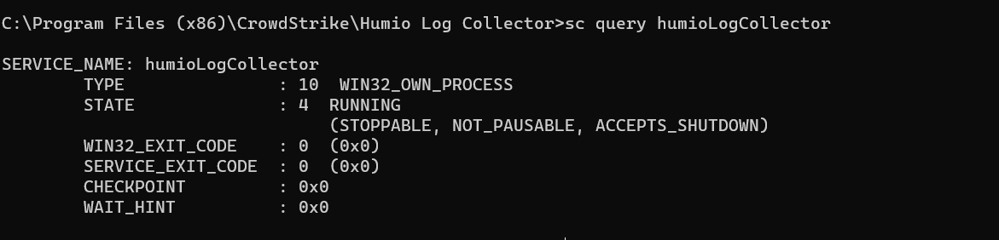
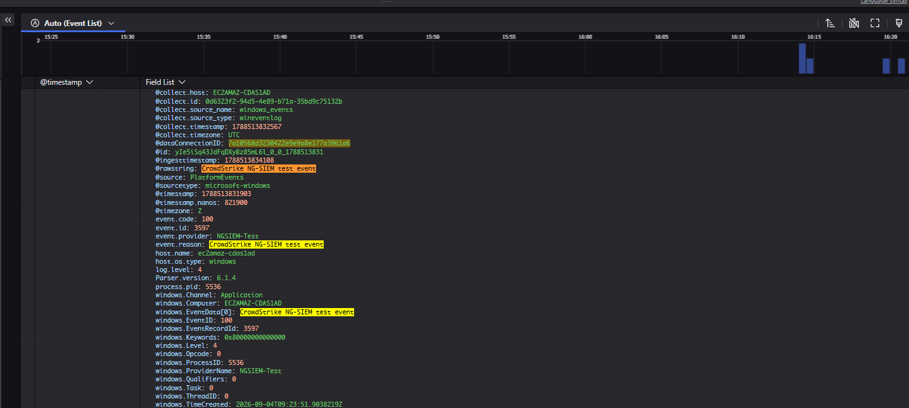
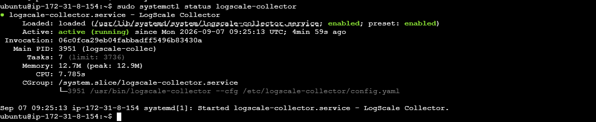
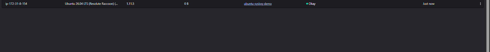
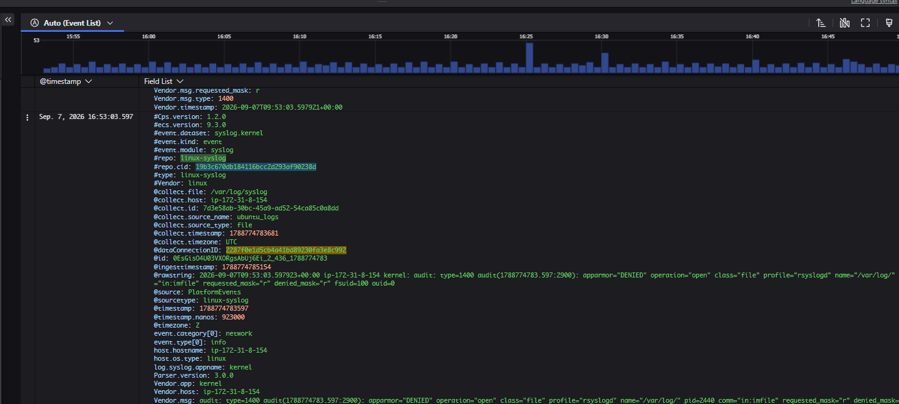
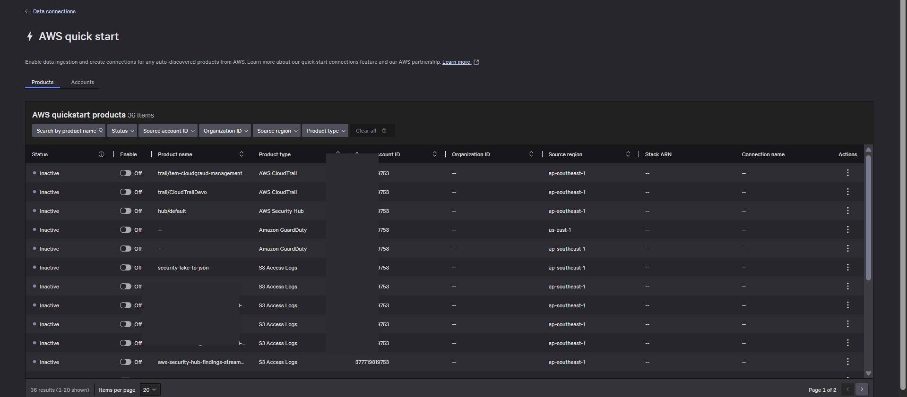
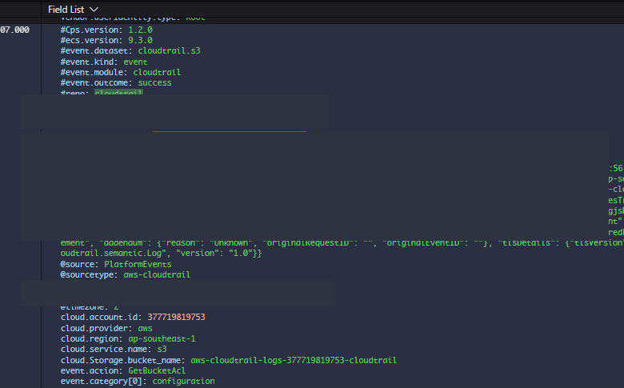

# CrowdStrike Falcon Next-Gen SIEM  
## Windows, Ubuntu/Linux และ AWS CloudTrail Log Onboarding Guide

คู่มือนี้สรุปขั้นตอนที่ทดสอบใช้งานจริงสำหรับส่ง Log เข้า **CrowdStrike Falcon Next-Gen SIEM (NG-SIEM)** จาก 3 แหล่งหลัก:

- Windows Event Log
- Ubuntu/Linux Syslog
- AWS CloudTrail

> **Security note:** อย่าใส่ API Key, Enrollment Token หรือ Credential จริงลงในเอกสาร/แชต ให้ใช้ placeholder เช่น `YOUR_API_KEY` และ `YOUR_API_URL`

---

# 1. ภาพรวม Architecture

```text
Windows Server / Windows EC2
        │
        └── Windows Event Log
             Security / System / Application
                      │
                      ▼
              Falcon Log Collector
                      │ HTTPS
                      ▼
               CrowdStrike NG-SIEM


Ubuntu / Linux EC2
        │
        ├── /var/log/syslog
        └── /var/log/auth.log
                      │
                      ▼
           Falcon LogScale Collector
                      │ HTTPS
                      ▼
               CrowdStrike NG-SIEM


AWS Account
        │
        └── AWS CloudTrail
                      │
                      ▼
             AWS Quick Start
                      │
                      ▼
               CrowdStrike NG-SIEM
```

---

# 2. Windows Event Log → CrowdStrike NG-SIEM

## 2.1 สร้าง Data Connection

ไปที่:

```text
Next-Gen SIEM
→ Data onboarding
→ Data connections
→ Add connection
```

เลือก Data Source ของ Microsoft Windows โดยใช้:

```text
Vendor  : Microsoft
Product : Microsoft Windows
Parser  : microsoft-windows
Type    : Push
```

ตัวอย่างชื่อ Connection:

```text
windows-eventlog-demo
```

หลังสร้าง Connection ให้เก็บค่าที่ CrowdStrike สร้างให้:

```text
API URL
API Key
```

---

## 2.2 ติดตั้ง Falcon Log Collector บน Windows

ดาวน์โหลด **Falcon Log Collector / LogScale Collector for Windows** แล้วติดตั้งบนเครื่อง Windows ที่ต้องการส่ง Event Log

ไฟล์ Configuration ที่ใช้ในการทดสอบ:

```text
C:\Program Files (x86)\CrowdStrike\Humio Log Collector\config.yaml
```

---

## 2.3 ตั้งค่า `config.yaml`

ตัวอย่าง:

```yaml
sources:
  windows_events:
    type: wineventlog
    channels:
      - name: Security
      - name: System
      - name: Application
    sink: crowdstrike_ngsiem

sinks:
  crowdstrike_ngsiem:
    type: hec
    token: YOUR_API_KEY
    url: YOUR_API_URL
    maxEventSize: 910000
    maxBatchSize: 12000000
    workers: 4
```

ความหมายของ Channel:

| Channel | ใช้สำหรับ |
|---|---|
| `Security` | Logon, Account, Privilege, Audit |
| `System` | Windows Service / OS / Driver |
| `Application` | Application Event Log |

---

## 2.4 Validate Configuration

เปิด **Command Prompt แบบ Run as administrator**

```cmd
cd "C:\Program Files (x86)\CrowdStrike\Humio Log Collector"
humio-log-collector.exe config validate --cfg config.yaml
```

ถ้า Configuration ผิด Collector จะบอก Error ก่อน Start Service

---

## 2.5 Start และตรวจสอบ Service

```cmd
sc start humioLogCollector
sc query humioLogCollector
```

สถานะที่ต้องการ:

```text
STATE : 4 RUNNING
```

### ตัวอย่าง Service ทำงานสำเร็จ



---

## 2.6 สร้าง Event สำหรับทดสอบ

```cmd
eventcreate /T INFORMATION /ID 100 /L APPLICATION /SO NGSIEM-Test /D "CrowdStrike NG-SIEM test event"
```

ถ้าสำเร็จจะขึ้นประมาณ:

```text
SUCCESS: An event of type 'INFORMATION' was created...
```

---

## 2.7 ตรวจ Log ใน CrowdStrike

ไปที่:

```text
Data connections
→ windows-eventlog-demo
→ Show events
```

หรือเปิด:

```text
Investigate
→ Advanced event search
```

Field สำคัญที่พบ:

```text
windows.Channel
windows.EventID
windows.Computer
windows.ProviderName
windows.EventData.*
event.code
event.provider
@rawstring
windows.XML
```

ตัวอย่าง Query:

### Security Log

```text
| windows.Channel = "Security"
```

### Logon Success

```text
| windows.EventID = 4624
```

### Logon Failed

```text
| windows.EventID = 4625
```

### ตัวอย่าง Windows Event ใน NG-SIEM



---

# 3. Ubuntu / Linux Syslog → CrowdStrike NG-SIEM

## 3.1 ตรวจสอบ OS และ Architecture

```bash
cat /etc/os-release
uname -m
```

ตัวอย่าง:

```text
Ubuntu 26.04 LTS
x86_64
```

> ตรวจสอบ Support Matrix ของ CrowdStrike ก่อนใช้ Production โดยเฉพาะ OS รุ่นใหม่

---

## 3.2 สร้าง Linux Syslog Data Connection

ไปที่:

```text
Next-Gen SIEM
→ Data onboarding
→ Data connections
→ Add connection
```

เลือก:

```text
Vendor  : Linux
Product : Linux Syslog
Parser  : linux-syslog
Type    : Push
```

ตัวอย่างชื่อ:

```text
linux-eventlog-demo
```

เก็บ:

```text
API URL
API Key
```

---

## 3.3 ติดตั้ง LogScale Collector แบบ Full Install

ไปที่:

```text
Data onboarding
→ Fleet management
→ Fleet overview
→ Get LogScale Collector
```

เลือก:

```text
Full install
→ macOS / Linux
→ Enrollment token
```

CrowdStrike จะสร้างคำสั่ง `curl` สำหรับติดตั้ง ให้ Copy คำสั่งนั้นไปรันบน Ubuntu โดยตรง

เมื่อสำเร็จจะเห็นข้อความประมาณ:

```text
Bootstrap complete
```

---

## 3.4 ตรวจสอบ Service

```bash
sudo systemctl daemon-reload
sudo systemctl status logscale-collector
```

สถานะที่ต้องการ:

```text
Active: active (running)
```

### ตัวอย่าง Service บน Ubuntu



---

## 3.5 ตรวจไฟล์ Log

```bash
ls -lh /var/log/syslog /var/log/auth.log
```

ไฟล์ที่ใช้ในการทดสอบ:

```text
/var/log/syslog
/var/log/auth.log
```

---

## 3.6 สร้าง Fleet Configuration

ไปที่:

```text
Fleet management
→ Config overview
→ New config
→ Empty config
```

ตัวอย่างชื่อ:

```text
ubuntu-syslog-demo
```

Configuration:

```yaml
sources:
  ubuntu_logs:
    type: file
    include:
      - /var/log/auth.log
      - /var/log/syslog
    sink: crowdstrike_ngsiem

sinks:
  crowdstrike_ngsiem:
    type: hec
    token: YOUR_API_KEY
    url: YOUR_API_URL
    maxEventSize: 910000
    maxBatchSize: 12000000
    workers: 4
```

จากนั้น **Publish Config**

---

## 3.7 สร้าง Group และ Assign Config

ไปที่:

```text
Fleet management
→ Groups
→ Create group
```

ตัวอย่างชื่อ:

```text
ubuntu-syslog-group
```

Filter เฉพาะเครื่อง:

```text
hostname="ip-172-31-8-154"
```

Assign Config:

```text
ubuntu-syslog-demo
```

จากนั้นตรวจที่:

```text
Fleet management
→ Fleet overview
```

ควรเห็น:

```text
Config name : ubuntu-syslog-demo
Status      : Okay
```

### ตัวอย่าง Collector ได้รับ Config แล้ว



---

## 3.8 แก้ Permission ของ `/var/log`

ในการทดสอบพบว่า Collector รันด้วย:

```text
User=logscale-collector
Group=logscale-collector
```

แต่ `/var/log/syslog` และ `/var/log/auth.log` อยู่ใน Group `adm`

เพิ่มสิทธิ์:

```bash
sudo usermod -aG adm logscale-collector
sudo systemctl restart logscale-collector
```

ตรวจสอบ:

```bash
id logscale-collector
```

ควรเห็น `adm` อยู่ใน Group list

---

## 3.9 สร้าง Test Log

```bash
logger -t NGSIEM-Test "CrowdStrike NG-SIEM Ubuntu test event"
```

ตรวจสอบ:

```bash
grep "NGSIEM-Test" /var/log/syslog
```

ถ้าเห็นข้อความ แปลว่าฝั่ง Ubuntu สร้าง Log สำเร็จ

---

## 3.10 ตรวจใน CrowdStrike

เปิด:

```text
Data connections
→ linux-eventlog-demo
→ Show events
```

ตัวอย่าง Field:

```text
#repo = linux-syslog
@collect.file = /var/log/syslog
@collect.host = ip-172-31-8-154
@collect.source_name = ubuntu_logs
@collect.source_type = file
```

### ตัวอย่าง Linux Syslog ใน NG-SIEM



---

# 4. AWS CloudTrail → CrowdStrike NG-SIEM

AWS Service Logs เช่น CloudTrail ไม่จำเป็นต้องใช้ Falcon Log Collector บน EC2  
สามารถใช้ **AWS Quick Start / Native AWS Connector** ได้โดยตรง

---

## 4.1 เปิด AWS Quick Start

ไปที่:

```text
Next-Gen SIEM
→ Data onboarding
→ Data connections
→ AWS quick start
```

CrowdStrike จะ Discover AWS Product ที่สามารถ Onboard ได้ เช่น:

```text
AWS CloudTrail
AWS Security Hub
Amazon GuardDuty
S3 Access Logs
```

### ตัวอย่าง AWS Quick Start



---

## 4.2 เลือก CloudTrail

เลือก CloudTrail ที่ต้องการ เช่น:

```text
trail/<CloudTrail Name>
```

เปลี่ยน:

```text
Off → On
```

CrowdStrike จะเริ่ม Deploy Integration ผ่าน AWS CloudFormation

สถานะจะเป็น:

```text
Deploying
```

แล้วเมื่อสำเร็จ:

```text
Active
```

> ถ้ามี CloudTrail หลาย Trail ควรตรวจสอบก่อนว่าแต่ละ Trail เก็บ Event ชุดเดียวกันหรือไม่ เพื่อป้องกัน Duplicate Ingest

---

## 4.3 ตรวจ CloudFormation หาก Deploy ไม่สำเร็จ

ไปที่ AWS:

```text
AWS Console
→ CloudFormation
→ Stacks
```

สถานะที่ควรได้:

```text
CREATE_COMPLETE
```

สถานะที่ควรตรวจสอบ:

```text
CREATE_FAILED
ROLLBACK_IN_PROGRESS
ROLLBACK_COMPLETE
```

---

## 4.4 ตรวจ CloudTrail Log ใน NG-SIEM

เมื่อ Connection Active:

```text
Data connections
→ AWS CloudTrail Connection
→ Show events
```

Query พื้นฐาน:

```text
#repo = cloudtrail
```

Field ที่พบ เช่น:

```text
cloud.account.id
cloud.region
cloud.service.name
event.action
event.provider
event.outcome
```

ตัวอย่าง:

```text
cloud.service.name = s3
event.action = GetBucketAcl
event.provider = s3.amazonaws.com
event.outcome = success
```

### ตัวอย่าง CloudTrail Event ใน Advanced Event Search



---

## 4.5 ตัวอย่าง Query AWS CloudTrail

### ดู S3

```text
#repo = cloudtrail
| cloud.service.name = "s3"
```

### ดู AWS Console Login

```text
#repo = cloudtrail
| event.action = "ConsoleLogin"
```

### ดู IAM

```text
#repo = cloudtrail
| cloud.service.name = "iam"
```

### ดู CreateUser

```text
#repo = cloudtrail
| event.action = "CreateUser"
```

---

# 5. เปรียบเทียบวิธี Onboarding

| Source | วิธี Onboarding | Log Source | Parser |
|---|---|---|---|
| Windows | Falcon Log Collector | Windows Event Log | `microsoft-windows` |
| Ubuntu/Linux | Falcon LogScale Collector | `/var/log/syslog`, `/var/log/auth.log` | `linux-syslog` |
| AWS CloudTrail | AWS Quick Start | AWS CloudTrail API / AWS Integration | CloudTrail parser |

---

# 6. Troubleshooting Checklist

## Windows

```cmd
sc query humioLogCollector
```

ต้องเป็น:

```text
STATE : 4 RUNNING
```

Validate:

```cmd
humio-log-collector.exe config validate --cfg config.yaml
```

หาก Connection เป็น `Idle / 0 B` ให้ตรวจ:

- API URL
- API Key
- Service Status
- Network TCP/443
- YAML indentation
- Windows Event Channel

---

## Ubuntu/Linux

ตรวจ Service:

```bash
sudo systemctl status logscale-collector
```

ดู Log ของ Collector:

```bash
sudo journalctl -u logscale-collector -n 100 --no-pager
```

ตรวจ Permission:

```bash
id logscale-collector
ls -l /var/log/syslog /var/log/auth.log
```

สร้าง Test Event:

```bash
logger -t NGSIEM-Test "CrowdStrike NG-SIEM Ubuntu test event"
```

---

## AWS CloudTrail

ถ้าสถานะ Quick Start ค้าง `Deploying`:

```text
AWS Console
→ CloudFormation
→ Stacks
```

ตรวจ Stack Event และ Permission

ถ้า Connection Active แต่ไม่มี Event:

- ตรวจ CloudTrail Logging
- ตรวจ Region
- ตรวจ Trail ที่เลือก
- ตรวจว่า CloudTrail มี Event ใหม่
- ตรวจ Connection ใน NG-SIEM

---

# 7. สรุป Flow

```text
Windows
Windows Event Log
      ↓
Falcon Log Collector
      ↓
NG-SIEM


Ubuntu
/var/log/*
      ↓
Falcon LogScale Collector
      ↓
NG-SIEM


AWS
CloudTrail
      ↓
AWS Quick Start
      ↓
NG-SIEM
```

---

**Document scope:** Windows Event Log, Ubuntu/Linux Syslog และ AWS CloudTrail onboarding เข้า CrowdStrike Falcon Next-Gen SIEM
